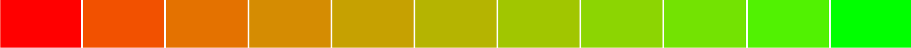
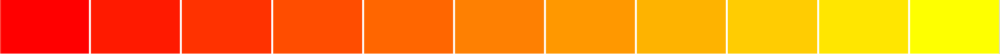
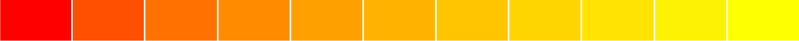
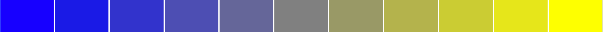
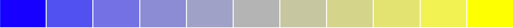
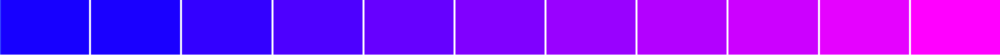
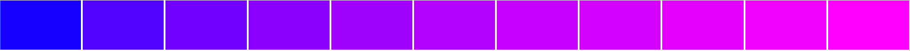
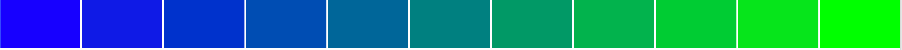
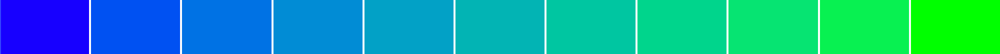

# better-color-tools

Better color manipulation for Sass and JavaScript/TypeScript.

## Installing

```
npm install better-color-tools
```

## Sass

Sass has built-in [color][sass-color] functions, but they aren’t as usable as they could be. Here’s why this library exists as an alternative.

### Mix

Let’s compare this library’s mix function to Sass’ (Sass on top; better-color-tools on bottom):

<table>
  <thead>
    <th>Blend</th>
    <th>Comparison</th>
  </thead>
  <tbody>
    <tr>
      <td>red–lime</td>
      <td></td>
    </tr>
    <tr>
      <td>red–yellow</td>
      <td></td>
    </tr>
    <tr>
      <td>blue–yellow</td>
      <td></td>
    </tr>
    <tr>
      <td>blue–fuchsia</td>
      <td></td>
    </tr>
    <tr>
      <td>blue–lime</td>
      <td></td>
    </tr>
  </tbody>
</table>

It may be hard to tell a difference at first, but upon closer inspection you’ll see better results with the bottom colors in each row:

- better-color-utils produces brighter, more vibrant colors when mixing complementary colors, while Sass results in [dark, muddy colors][computer-color] (compare mid tones in all examples)
- better-color-utils gives better spacing between colors while Sass inconsistently clumps certain hues together (compare blues in all examples)
- better-color-utils produces more expected colors than Sass (compare how better-color-tools passes through teal in **blue–lime** while Sass doesn’t)

#### Usage

```scss
@use 'better-color-tools' as color;

// mix color (0 = pure color1, 0.5 = even blend, 1 = pure color2)
$mix: color.mix(#1a7f37, #cf222e, 0.4);
```

### Lighten / Darken

⚠️ Still in development. It’s important to note that Sass’ new [`color.scale()`][sass-color-scale] tool is pretty advanced, and is actually good way to lighten / darken colors (previous methods have been lacking). Right now Sass’ `color.scale()` produces
better results than this library, and I’m not happy with that 🙂.

```scss
@use 'better-color-tools' as color;

// 0 = current color, 1 = white, -1 = black
$lighter: color.lighten(#cf222e, 0.25);

// 0 = current color, 1 = black, -1 = white
$darker: color.darken(#cf222e, 0.25);
```

## JavaScript / TypeScript

### Mix

[View comparison](#mix) (Sass’ mix function is a generic implementation of mixing you’ll find with other libraries in JavaScript)

```ts
import color from 'better-color-tools';

// mix color (0.5 = even blend, 0 = color 1, 1 = color 2)
const mix = color.mix('#1a7f37', '#cf222e', 0.4);
```

### Lighten / Darken

⚠️ In development ([see note](#lighten--darken))

```ts
import color from 'better-color-tools';

// 1 = white, 0 = current color, -1 = black
const lighter = color.lighten('#cf222e', 0.5);

// 1 = black, 0 = current color, -1 = white
const darker = color.darken('#cf222e', 0.5);
```

### Conversion

Color conversion between RGB and hexadecimal is a trivial 1:1 conversion, so this library isn’t better than any other in that regard.

It’s in HSL handling where approaches differ. Because HSL is a smaller color space than RGB, in order to use it, it **requires some use of decimals.** So any library that rounds out-of-the-box will yield different results.

Compare this library to [color-convert], converting from RGB -> HSL -> RGB

```ts
const original = [167, 214, 65];
color.from(color.from(original).hsl).rgb; // ✅ [167, 214, 65]

convert.hsl.rgb(convert.rgb.hsl(...original)); // ❌ [168, 215, 66]
```

2 things are the cause of the difference:

1. **JavaScript’s rounding errors.** Many implementations are borrowed from other languages that don’t have JavaScript’s “[bad math][number-precision].” This implementation was written with JavaScript in mind and minimizes decimal calculations through
   tricks like normalizing to `255` rather than `1.`
2. **No rounding by default.** As stated before, **HSL requires decimal places** to produce the full RGB color space. When a library rounds by default it will always make HSL conversions inaccurate. This is a known limitation, so libraries like
   color-convert will allow you to use decimals. But that generates numbers like `hsl(78.9261744966443, 64.50216450216452%, 54.70588235294118%)`. Compare that to better-color-tools: `hsl(78.926, 64.5%, 54.7%)`. Why do you have to choose between accuracy
   and utility?

#### Usage

```ts
import color from 'better-color-tools';

// convert color to hex
color.from('rgb(196, 67, 43)').hex; // '#c4432b'
color.from([196, 67, 43]).hex; // '#c4432b'
color.from('rgb(196, 67, 43)').hexVal; // 0xc4432b

// convert color to rgb
color.from('#C4432B').rgb; // 'rgb(196, 67, 43)'
color.from(0xc4432b).rgb; // 'rgb(196, 67, 43)'
color.from('#C4432B').rgbVal; // [196, 67, 43, 1]

// convert color to rgba
color.from('#C4432B').rgba; // 'rgba(196, 67, 43, 1)'
color.from(0xc4432b).rgba; // 'rgba(196, 67, 43, 1)'
color.from('#C4432B').rgbaVal; // [196, 67, 43, 1]

// convert color to hsl
color.from('#C4432B').hsl; // 'hsl(9.412, 64%, 46.9%, 1)'
color.from(0xc4432b).hsl; // 'hsl(9.412, 64%, 46.9%, 1)'
color.from('#C4432B').hslVal; // [9.412, 0.64, 0.469, 1]

// convert color names to hex
color.from('rebeccapurple').hex; // '#663399'
```

[color-convert]: https://github.com/Qix-/color-convert
[computer-color]: https://www.youtube.com/watch?v=LKnqECcg6Gw&vl=en
[number-precision]: https://github.com/nefe/number-precision
[sass-color]: https://sass-lang.com/documentation/modules/color
[sass-color-scale]: https://sass-lang.com/documentation/modules/color#scale
