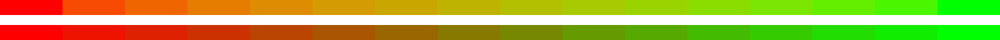
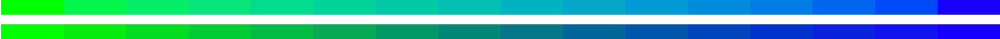
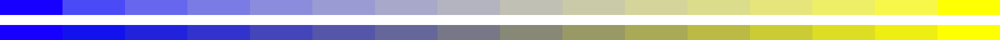
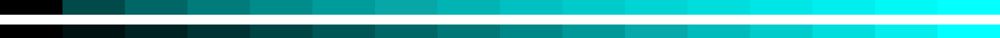

# better-color-tools

Better color manipulation for Sass and JavaScript/TypeScript. Fast (`75,000` ops/s) and lightweight (`3.7 kB` gzip).

Supports:

- ✅ RGB / Hex
- ✅ HSL
- ✅ [P3]

## Installing

```
npm install better-color-tools
```

## Mix

Not all mixing algorithms are created equal. A proper color mixer requires [gamma correction][gamma], something most libraries omit (even including Sass, CSS, and SVG). Compare this library’s gamma-corrected results (top) with most libraries’ default mix
function:










You’ll notice in all of the bottom gradients, you encounter muddy/grayed-out colors, as well as clumping (colors bunch up around certain shades or hues). By using this tool, you’ll be set free of all those ugly colors and experience the beauty of how
graphics are supposed to look.

```scss
// Sass
@use 'better-color-tools' as color;

$mix: color.mix(#1a7f37, #cf222e, 0); // 100% color 1, 0% color 2
$mix: color.mix(#1a7f37, #cf222e, 0.25); // 75%, 25%
$mix: color.mix(#1a7f37, #cf222e, 0.5); // 50%, 50%
$mix: color.mix(#1a7f37, #cf222e, 0.75); // 25%, 75%
$mix: color.mix(#1a7f37, #cf222e, 1); // 0%, 100%
```

```ts
// JavaScript / TypeScript
import color from 'better-color-tools';

const mix = color.mix(0x1a7f37, 0xcf222e, 0); // 100% color 1, 0% color 2
const mix = color.mix(0x1a7f37, 0xcf222e, 0.25); // 75%, 25%
const mix = color.mix(0x1a7f37, 0xcf222e, 0.5); // 50%, 50%
const mix = color.mix(0x1a7f37, 0xcf222e, 0.75); // 25%, 75%
const mix = color.mix(0x1a7f37, 0xcf222e, 1); // 0%, 100%
```

_Note: `0xcf222e` in JS is just another way of writing `'#cf222e'` (replacing the `#` with `0x`). Either are valid; use whichever you prefer!_

### Advanced: gamma adjustment

To change the gamma adjustment, you can pass in an optional 4th parameter. The default gamma is `2.2`, but you may adjust it to achieve different results (if unsure, best to always omit this option).

```scss
// Sass
$gamma: 2.2; // default
$mix: color.mix(#1a7f37, #cf222e, 0, $gamma);
```

```ts
// JavaScript / TypeScript
const gamma = 2.2; // default
const mix = color.mix(0x1a7f37, 0xcf222e, 0, gamma);
```

## Lighten / Darken

The lighten and darken methods also use [gamma correction][gamma] for improved results (also better than Sass’ `color.lighten()` and `color.darken()`). This method is _relative_, so no matter what color you start with, `darken(…, 0.5)` will always be
halfway to black, and `lighten(…, 0.5)` will always be halfway to white.

```scss
// Sass
@use 'better-color-tools' as color;

$lighter: color.lighten(#cf222e, 0); // 0% lighter (original color)
$lighter: color.lighten(#cf222e, 0.25); // 25% lighter
$lighter: color.lighten(#cf222e, 1); // 100% lighter (pure white)

$darker: color.darken(#cf222e, 0); // 0% darker (original color)
$darker: color.darken(#cf222e, 0.25); // 25% darker
$darker: color.darken(#cf222e, 1); // 100% darker (pure black)
```

```ts
// JavaScript / TypeScript
import color from 'better-color-tools';

color.lighten(0xcf222e, 0); // 0% lighter (original color)
color.lighten(0xcf222e, 0.25); // 25% lighter
color.lighten(0xcf222e, 1); // 100% lighter (pure white)

color.darken(0xcf222e, 0); // 0% darker (original color)
color.darken(0xcf222e, 0.25); // 25% darker
color.darken(0xcf222e, 1); // 100% darker (pure black)
```

## Convert (JS/TS only)

Color conversion between RGB and hexadecimal is a trivial 1:1 conversion, so this library isn’t better than any other in that regard. However, it should be noted that [HSL is lossy when rounding to integers][hsl-rgb], so by default this library persists
HSL decimals to prevent rounding errors when converting back-and-forth.

`color.from()` takes any valid CSS string, hex number, or RGBA array (values normalized to `1`) as an input, and can generate any desired output as a result:

```ts
import color from 'better-color-tools';

color.from('rgb(196, 67, 43)').hex; // '#c4432b'
color.from('rebeccapurple').hsl; // 'hsl(270, 50%, 40%)'
```

| Output   |    Type    | Example                     |
| :------- | :--------: | :-------------------------- |
| `hex`    |  `string`  | `"#ffffff"`                 |
| `hexVal` |  `number`  | `0xffffff`                  |
| `rgb`    |  `string`  | `"rgb(255, 255, 255)"`      |
| `rgbVal` | `number[]` | `[1, 1, 1, 1]`              |
| `rgba`   |  `string`  | `"rgb(255, 255, 255, 1)"`   |
| `hsl`    |  `string`  | `"hsl(360, 0%, 100%)"`      |
| `hslVal` | `number[]` | `[360, 0, 1, 1]"`           |
| `p3`     |  `string`  | `"color(display-p3 1 1 1)"` |

_Note: although this library can convert FROM a CSS color name, there is no method to convert INTO one (as over 99% of colors have no standardized name). However, you may import `better-color-tools/dist/css-names.js` for an easy-to-use map for your
purposes._

#### A note on P3

This library converts sRGB to P3 “lazily,” meaning every channel is converted 1:1. This differs from some conversions which attempt to simulate hardware differences. Compare this library to colorjs.io:

| P3 Color | better-color-tools | colorjs.io |
| :------: | :----------------: | :--------: |
| `1 0 0`  |     `255 0 0`      | `250 0 0`  |

For the most part, this approach makes P3 much more usable for web and is even [recommended by Apple for Safari](https://webkit.org/blog/10042/wide-gamut-color-in-css-with-display-p3/).

## TODO / Roadmap

- **Planned**: Adding color spaces like [Adobe](https://en.wikipedia.org/wiki/Adobe_RGB_color_space) and [Rec 709](https://en.wikipedia.org/wiki/Rec._709) to allow color mixing and lightening/darkening to use different perceptual color algorithms
- **Planned**: Generate nice, gamma-corrected CSS gradients (with P3 enhancements for Safari)

[color-convert]: https://github.com/Qix-/color-convert
[hsl]: https://en.wikipedia.org/wiki/HSL_and_HSV#Disadvantages
[hsl-rgb]: https://pow.rs/blog/dont-use-hsl-for-anything/
[gamma]: https://observablehq.com/@sebastien/srgb-rgb-gamma
[number-precision]: https://github.com/nefe/number-precision
[p3]: https://developer.mozilla.org/en-US/docs/Web/CSS/color_value/color()
[sass-color]: https://sass-lang.com/documentation/modules/color
[sass-color-scale]: https://sass-lang.com/documentation/modules/color#scale
